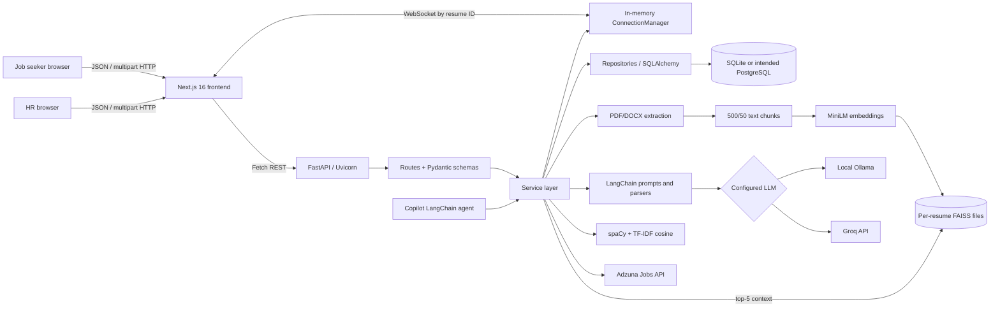
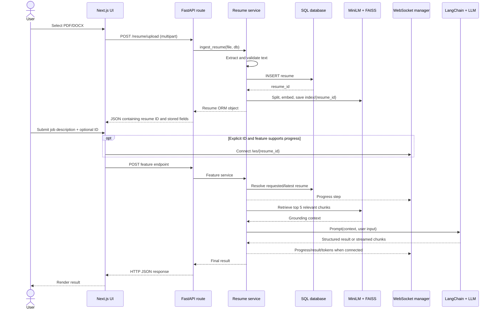
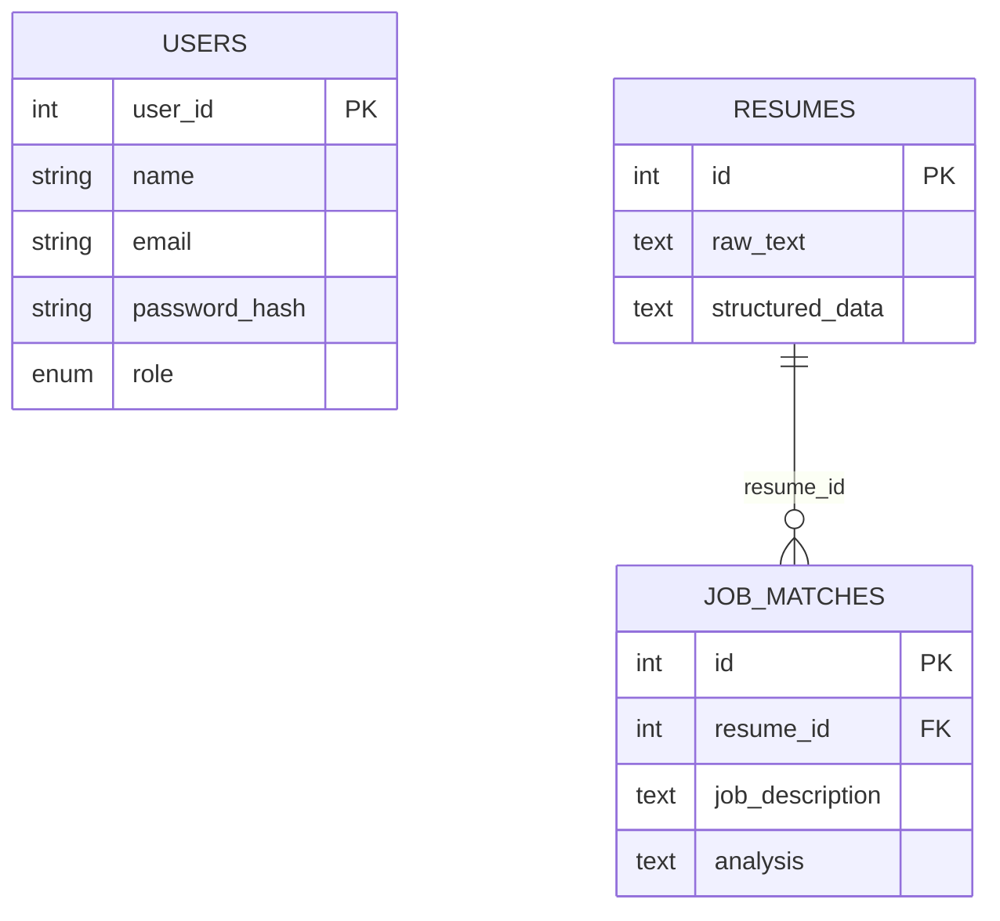

# AI Job Automation — Project Interview Guide

> **Evidence standard used in this guide:** This document describes the repository as it exists in the current working tree, not merely the generated frontend README. Exact paths and function names are included so claims can be checked. Statements marked **Inference** explain likely intent; statements marked **Suggested improvement** are not implemented today. No secret values are reproduced.

## 1. Project overview

### Project name

**AI Job Automation** (the name used by the FastAPI health response, Next.js metadata, navigation, and home page).

### One-line description

AI Job Automation is a role-aware web application that helps job seekers upload and query resumes, compare them with jobs, improve ATS alignment, and generate cover letters, while giving HR users an AI-assisted multi-candidate ranking tool.

### Problem statement

Job seekers repeatedly tailor the same resume for different job descriptions, identify missing skills, write cover letters, and interpret ATS fit. Recruiters must compare many resumes against one role. These activities are slow, inconsistent, and difficult to do manually at scale.

### Why it was needed

The code brings related tasks into one workflow. A job seeker uploads a resume once; the backend persists its text and creates a semantic FAISS index. Several tools then retrieve relevant resume chunks rather than sending an arbitrary entire document to the model. HR users get a separate workflow that combines semantic judgment from an LLM with deterministic TF-IDF similarity.

This motivation is an **inference from the implemented features and prompts**, not a written product-research claim in the repository.

### Intended users

- **USER role / job seeker:** resume upload, job matching, resume improvement, cover-letter generation, and resume Q&A.
- **HR role / recruiter:** ranking multiple candidate PDFs against one job description.

The role-specific UI is implemented in `front-end/app/components/AppShell.tsx`, `front-end/app/components/Navbar.tsx`, and `front-end/app/page.tsx`. Server-side role enforcement currently exists only on candidate ranking in `backend/routes/candidate_ranking.py`.

### Problems it solves

- Reuses a stored resume across job-specific workflows.
- Finds relevant resume evidence through vector retrieval.
- Returns structured ATS match scores, matched/missing skills, reasoning, and recommendations.
- Produces targeted resume suggestions and cover letters without asking the model to invent experience.
- Supports conversational resume questions with per-resume in-memory history and token streaming.
- Ranks multiple candidates using a hybrid AI and lexical similarity score.
- Can search Adzuna job listings and route career requests through an agent API, although these two backend capabilities have no current frontend screen.

## 2. My interview introduction

Adapt “I built” to “I contributed to” if this was a team project. The repository does not contain authorship metadata detailed enough to prove one person's exact contribution.

### 30-second explanation

“I built AI Job Automation, a full-stack application for job seekers and recruiters. Job seekers can upload a PDF or DOCX resume and use it for ATS job matching, resume suggestions, cover-letter generation, and contextual chat. The backend uses FastAPI, SQLAlchemy, LangChain, a configurable Ollama or Groq model, Hugging Face embeddings, and a per-resume FAISS index. HR users can upload multiple candidate PDFs and get a ranking that combines a 70% AI score with 30% TF-IDF similarity. The frontend is a role-aware Next.js and TypeScript application.”

### 1-minute explanation

“My project is called AI Job Automation. It addresses the repeated manual work in tailoring applications and screening resumes. The frontend is built with Next.js 16, React 19, TypeScript, and Tailwind CSS. The backend is FastAPI with SQLAlchemy and a configurable SQLite or PostgreSQL database. When a user uploads a resume, the backend extracts text, stores it, splits it into overlapping chunks, generates MiniLM embeddings, and saves a separate FAISS index for that resume. Job matching, resume improvement, cover-letter generation, and chat retrieve the most relevant five chunks and pass grounded context to LangChain prompts running on Ollama or Groq. Chat additionally streams tokens through a WebSocket and keeps conversation history in memory. Authentication uses bcrypt password hashes, JWT bearer tokens, and USER/HR roles; the HR ranking endpoint enforces the HR role. Candidate ranking uses both an LLM evaluation and TF-IDF cosine similarity, then sorts candidates by a weighted final score. I would describe it as a functional prototype with strong AI workflow separation, while also being honest that its security, persistence, Docker setup, and automated tests need production hardening.”

### Detailed 2–3 minute explanation

“AI Job Automation is a full-stack career-assistance platform with two user experiences. A job seeker registers as USER and an HR user registers as HR. The Next.js frontend stores the returned JWT and role in browser local storage, uses an application shell to guard pages, and renders different navigation for the two roles.

“The central job-seeker workflow starts with resume upload. The browser sends multipart form data to FastAPI. The backend accepts PDF or DOCX, extracts its text, stores the raw text plus lightweight source metadata in the `resumes` table, splits the document into 500-character chunks with 50-character overlap, embeds those chunks with `all-MiniLM-L6-v2`, and writes a per-resume FAISS index to disk. The returned resume ID becomes the link between SQL data, the vector index, WebSocket status updates, and subsequent tools. If the UI omits the ID, the backend deliberately uses the latest resume globally.

“For a job match, the service retrieves the five most relevant resume chunks for the supplied job description and sends them to a strict LangChain prompt. A JSON parser enforces a response containing a match score, matched and missing skills, reasoning, and recommendations. Resume improvement and cover-letter generation use the same retrieval pattern with different prompts and output shapes. Resume chat uses `RunnableWithMessageHistory` so each resume ID has a conversational history. The HTTP request performs the generation, while a WebSocket registered under the resume ID carries progress events and streamed model tokens.

“The HR workflow is intentionally separate. An HR-authenticated endpoint receives a job description and multiple resume uploads. For each PDF it extracts text, preprocesses and lemmatizes both texts with spaCy, computes TF-IDF cosine similarity using unigrams and bigrams, and asks the LLM for a structured recruiting assessment. The final score is 70% AI score and 30% TF-IDF score; candidates are sorted descending and assigned ranks. These ranking results are returned directly and are not stored.

“Architecturally, routes handle HTTP concerns, Pydantic schemas validate request shapes, services orchestrate workflows, repositories isolate the SQL writes and reads that exist, chains define prompts and parsing, and core modules configure LLMs, embeddings, security, CORS, and WebSockets. I would highlight the reusable retrieval layer and hybrid ranking as the main design strengths. I would also be transparent that this is a prototype: most job-seeker APIs are not protected on the server, users do not own resumes, chat and socket state are process-local, FAISS files are local, the Compose file currently fails validation, and test coverage is minimal. My next production step would be resource ownership and authorization, durable shared storage/state, migrations, stricter upload validation, secrets management, and broader mocked integration tests.”

## 3. Complete technology stack

### Frontend

| Technology | Evidence | Why it is used here |
|---|---|---|
| Next.js 16.2.6 App Router | `front-end/package.json`, `front-end/app/` | File-based pages, layouts, dynamic resume-ID routes, production build, and client navigation. |
| React 19.2.4 | `front-end/package.json`, page components | Local form/result state, effects, refs, and auth-store subscriptions. |
| TypeScript 5 | `front-end/tsconfig.json`, `.tsx` files | Strict types for API responses, roles, forms, and component state. |
| Tailwind CSS 4 | `front-end/package.json`, `front-end/app/globals.css` | Utility-class UI styling and responsive layouts. |
| Browser Fetch, WebSocket, Local Storage, Clipboard | `front-end/app/lib/api.ts`, chat/match/improvement/cover-letter pages | HTTP API calls, live progress/token updates, token persistence, and copying a generated letter. |

There is no frontend state-management library, form library, or component library; React state and browser APIs are used directly.

### Backend

| Technology | Evidence | Why it is used here |
|---|---|---|
| Python 3.11 container / 3.13 CI | `backend/Dockerfile`, `.github/workflows/push-ci.yml` | Backend runtime. The version mismatch is a portability risk. |
| FastAPI 0.136.1 | `backend/main.py`, `backend/routes/` | HTTP and WebSocket routing, dependency injection, multipart uploads, OpenAPI, and Pydantic integration. |
| Uvicorn 0.46.0 | `backend/Dockerfile`, `backend/main.py` | ASGI server for FastAPI. |
| Pydantic 2.13.3 | `backend/schemas/` | Request validation and selected response contracts. |
| SQLAlchemy 2.0.49 | `backend/db/session.py`, models/repositories | ORM, sessions, table definitions, and SQL parameterization. |

### Database and ORM

- SQLAlchemy reads `DATABASE_URL`; therefore SQLite is used in checked-in/test databases and PostgreSQL is intended through `psycopg2-binary` and Compose.
- ORM models: `Resume`, `JobMatch`, and `User`.
- JSON-like AI results are stored as serialized text, not native JSON columns.
- Tables are created through `Base.metadata.create_all`, not migrations.

### AI/ML and retrieval

| Technology | Actual use |
|---|---|
| LangChain | Prompt composition, model calls, JSON parsing, tools/agent, retrievers, and chat history. |
| Ollama or Groq | Configurable chat-model provider selected by `get_llm()` in `backend/core/llm.py`. |
| `sentence-transformers/all-MiniLM-L6-v2` | Local embedding model returned by `get_embeddings()`. |
| FAISS | Per-resume on-disk vector indexes and top-5 retrieval. |
| Recursive character splitting | 500-character chunks with 50-character overlap. |
| scikit-learn TF-IDF and cosine similarity | Deterministic lexical score for HR candidate ranking. |
| spaCy `en_core_web_sm` | Cleaning, stop-word filtering, and lemmatization before TF-IDF. |

The very large `requirements.txt` includes many packages not referenced by application imports. The table above lists technologies actually exercised by the source code.

### Authentication and authorization

- `passlib` with bcrypt hashes passwords.
- `python-jose` signs and verifies HS256 JWTs.
- FastAPI `HTTPBearer` extracts bearer credentials.
- USER and HR enum roles exist in model and schema layers.
- `required_roles(UserRole.HR)` protects only `POST /hr/candidates/rank`.
- Frontend route gating is role-aware but is a user-experience control, not a security boundary.

### Background processing and asynchronous work

There is **no queue, task broker, scheduled job, Celery worker, or separate worker service**. Async route handlers use `asyncio.to_thread` for blocking FAISS, LLM, TF-IDF, and `requests` work. Candidate resumes are processed sequentially in an async function. These are request-scoped operations, not durable background jobs.

### Real-time communication

FastAPI WebSockets and an in-memory `ConnectionManager` map one socket to each resume ID. Match, improvement, cover-letter, and chat services publish progress. Chat publishes individual tokens. The job-match and resume-improvement pages connect only when an explicit resume ID is supplied; latest-resume mode uses HTTP only. Cover-letter WebSocket code is commented out. Chat uses a hard-coded `ws://localhost:8000` URL.

### External services

- **Groq API** is optional when `LLM_PROVIDER=groq`.
- **Ollama** is the local alternative and must be running with the configured model.
- **Adzuna India Jobs API** returns up to five listings for `search_jobs_service`.
- Hugging Face model assets are normally downloaded on first embedding-model use.

There is no cloud object storage, email provider, payment provider, analytics SDK, or deployed hosting configuration in the code.

### Testing and quality tools

- Pytest and FastAPI `TestClient`; only the root endpoint is tested in `backend/tests/test_api.py`.
- ESLint 9 with Next core-web-vitals and TypeScript rules.
- TypeScript strict mode and the Next production compiler.
- GitHub Actions installs Python 3.13 dependencies and runs backend tests on pushes to `main`.

### Docker, deployment, and development

- Multi-stage Node 20 Alpine frontend image with non-root `node` runtime user.
- Python 3.11 backend image.
- Compose declares frontend, backend, and PostgreSQL 16 services, but currently fails schema validation due to `volumes` being nested under `db.environment`, and no top-level volume declaration exists.
- No Kubernetes, Terraform, reverse proxy, production process manager, deployment target, or database migration tool is configured.

## 4. High-level architecture

The browser calls FastAPI directly. FastAPI routes validate inputs and delegate to services. Services use repositories for SQL persistence, retrieval functions for per-resume FAISS access, LangChain chains for AI output, and an in-memory socket manager for progress. HR ranking is independent of the resume database/vector-store workflow.



There is no separate worker despite asynchronous-looking flows. `asyncio.to_thread` uses the API process's thread pool.

## 5. Complete application flow

### Opening the application and authentication

1. `front-end/app/layout.tsx` wraps all pages in `AppShell`.
2. `AppShell` reads token and role from `localStorage` through the external-store helpers in `front-end/app/lib/api.ts`.
3. An unauthenticated visitor is redirected to `/login`. An authenticated visitor is redirected away from login/register and shown only routes for their stored role.
4. Register sends name, email, password, and a client-selectable role to `POST /auth/register`. Pydantic validates the email and enum. The route checks for an existing email, hashes the password, inserts a `User`, creates a one-hour JWT, and returns token plus role.
5. Login queries by email, verifies bcrypt, and returns a similar JWT.
6. The browser stores the token, token type, and role in local storage. Only candidate ranking sends the bearer token to the backend.

### Main job-seeker workflow

1. **Upload:** `front-end/app/resume/upload/page.tsx` sends a `File` to `POST /resume/upload`.
2. **Extract:** `ingest_resume()` chooses `load_pdf()` or `load_docx()` by filename suffix, extracts text, and rejects unsupported or empty content.
3. **Persist:** `createresume()` inserts raw text and JSON-serialized `{"source": filename}` metadata into `resumes`.
4. **Index:** `build_faiss_index()` splits, embeds, builds FAISS, and saves `vectorstore/faiss/{resume_id}/index.faiss` plus `index.pkl`.
5. **Reuse:** a match/improvement/cover-letter/chat request supplies a resume ID or omits it. `get_resume_by_id_or_latest()` resolves it; omitted means the highest ID across all users.
6. **Retrieve:** `get_resume_context()` loads that resume's FAISS index with the same embedding model and returns the concatenated top five chunks relevant to the question or job description.
7. **Generate:** the feature-specific LangChain prompt calls Ollama/Groq. JSON-oriented tools parse the output with `JsonOutputParser`; chat streams model message chunks.
8. **Progress:** if a WebSocket is connected to `/ws/{resume_id}`, the service sends named steps. Chat additionally sends each token.
9. **Respond:** the HTTP endpoint returns the final result; UI state renders score cards, lists, prose, or the generated letter/chat message.

### Main workflow sequence



### Request validation, errors, and output

- JSON requests use Pydantic schemas. Multipart endpoints use FastAPI `File`/`Form` declarations.
- Schema errors automatically produce HTTP 422.
- Resume upload catches all exceptions and returns HTTP 400, but wraps the message twice as “Error processing file.”
- Match, improvement, cover letter, and chat convert only `ValueError` for a missing resume to HTTP 404. Missing/corrupt FAISS data and model failures therefore generally become default HTTP 500 responses.
- `/analyze-job/` catches every exception and returns its string in a 500 response, which can leak internal detail.
- Auth returns deliberate 400/401 responses. Role checks return 403; missing/invalid bearer credentials return 401 or framework authentication errors.
- Job search and copilot do not add route-level exception handling.
- Frontend error quality varies: auth and candidate ranking surface backend details, while several clients replace them with generic messages. Cover-letter pages log errors without rendering an error message.

## 6. Codebase structure

### Root

- `docker-compose.yml`: intended three-service local stack; currently invalid.
- `.github/workflows/push-ci.yml`: backend-only push CI.
- `PROJECT_INTERVIEW_GUIDE.md`: this code-verified guide.

### Backend (`backend/`)

- `backend/main.py`: FastAPI entry point; installs CORS, calls `create_all`, registers all routers, and defines `GET /`.
- `backend/requirements.txt`: fully pinned Python environment, much broader than imports used by this application.
- `backend/Dockerfile`: copies dependencies and runs `uvicorn main:app` from `/app`; Compose bind-mounts `backend` there.
- `backend/core/`: cross-cutting configuration.
  - `config.py`: loads environment variables.
  - `llm.py`: selects `ChatOllama` or `ChatGroq`.
  - `embeddings.py`: constructs MiniLM embeddings.
  - `security.py`: hashes/verifies passwords, creates/decodes JWTs, resolves current users, and enforces roles.
  - `middleware.py`: permissive CORS.
  - `ws_manager.py`: in-memory socket registry.
  - `parsers.py`: an exported parser that is currently unused.
- `backend/db/session.py`: engine, session factory, declarative base, and request-scoped `get_db()` dependency.
- `backend/models/`: SQLAlchemy tables: `resume.py`, `job_match.py`, `user.py`.
- `backend/schemas/`: Pydantic request/response shapes. Not every route declares a response model.
- `backend/routes/`: thin HTTP/WebSocket controllers for auth, resume, analysis, match, improvement, cover letter, chat, jobs, copilot, HR ranking, and sockets.
- `backend/services/`: workflow orchestration and scoring. `FAISS.py` is the retrieval/storage adapter; `tfidf.py` is the lexical scoring service.
- `backend/repository/`: `resume.py` and `job_match.py` encapsulate the few SQL reads/writes. Auth accesses SQLAlchemy directly rather than using a user repository.
- `backend/chains/`: feature-specific LangChain prompts/pipelines. Module import constructs model clients.
- `backend/tools/`: LangChain wrappers that let the copilot agent call cover-letter, job-search, and resume-improvement services.
- `backend/utils/`: PDF/DOCX parsing, candidate-PDF reading, and RAG splitting.
- `backend/preprocessing/text_preprocessor.py`: normalization and spaCy lemmatization for TF-IDF.
- `backend/vectorstore/faiss/{id}/`: local serialized vector index. The repository currently contains one index for ID 25.
- `backend/tests/test_api.py`: sole automated backend test.
- `backend/test.py`: manual LLM invocation script, not a pytest test.
- Checked-in `.db`, cache, bytecode, and FAISS artifacts are development state, not architectural requirements.

### Frontend (`front-end/`)

- `front-end/app/layout.tsx`: root layout, fonts, metadata, and `AppShell`.
- `front-end/app/components/AppShell.tsx`: client-side auth/role route guard.
- `front-end/app/components/Navbar.tsx`: role-specific navigation and logout.
- `front-end/app/lib/api.ts`: base URL, HTTP clients, auth storage, bearer construction for HR ranking, errors, and cover-letter response normalization.
- `front-end/app/page.tsx`: role-specific dashboard.
- `front-end/app/login/page.tsx`, `register/page.tsx`: auth forms.
- `front-end/app/resume/upload/page.tsx`: upload and returned-ID screen.
- `front-end/app/Job_match/page.tsx`: match form/results and optional socket progress.
- `front-end/app/Resume_Improvements/page.tsx`: suggestion form/results and optional socket progress.
- `front-end/app/Cover_letter/page.tsx` and `[id]/page.tsx`: latest/explicit-resume cover-letter variants. Socket code in the dynamic page is commented out.
- `front-end/app/Chat/page.tsx` and `[id]/page.tsx`: choose a resume and chat; only explicit IDs open a socket.
- `front-end/app/candidate-ranking/page.tsx`: HR multipart upload and ranking display.
- `front-end/app/hr/candidates/rank/page.tsx`: re-export alias of the ranking page, but `AppShell` does not allow this alias for HR users; it redirects to `/`.
- `front-end/app/globals.css`: Tailwind import, theme variables, dark preference, and base font.
- `front-end/Dockerfile`: dependency, build, and runtime stages.

### Layer connections

`page.tsx` component → `api` method → FastAPI route → Pydantic/FastAPI validation → service → repository/FAISS/chain/external API → route response → frontend state/rendering. Services publish optional side-channel events through `core.ws_manager.manager`.

## 7. Database design

### Models

| Table | Important columns | Purpose and relationships |
|---|---|---|
| `users` | `user_id` PK/index, required `name`, required `email`, required `password_hash`, required enum `role` | Authentication identity. No relationship to resumes or matches. Email is checked in application code but has no DB unique constraint. |
| `resumes` | `id` PK/index, `raw_text`, `structured_data` text | Stores extracted/raw resume text and serialized JSON-like metadata or parsed output. No owner FK. |
| `job_matches` | `id` PK/index, `resume_id` FK → `resumes.id`, `job_description`, `analysis` text | Stores analysis only for the legacy `/analyze-job/` flow. The normal `/match/` endpoint does not insert records. |

No ORM `relationship()` properties or cascade behavior are defined. `resume_id` is nullable at the SQLAlchemy level, and SQLite foreign-key enforcement is not explicitly enabled.



`USERS` is intentionally disconnected in this diagram because that is the current schema, not because disconnected ownership is recommended.

### Data movement

- File upload writes one `resumes` row, then writes a related on-disk FAISS directory named by the new ID.
- `/resume/parse` writes a parsed resume row but does **not** build FAISS, so retrieval-based features can fail for its returned ID.
- `/analyze-job/` parses and writes a resume plus a `job_matches` row but also does **not** build FAISS.
- `/match/`, improvement, cover letter, and chat read a resume only to resolve existence/ID and use the matching FAISS directory; they do not store their outputs.
- Candidate ranking and job search do not use the database.

### Table creation caveat

Startup uses `Base.metadata.create_all` rather than migrations. `main.py` imports `Resume` and `JobMatch` directly; `User` is registered indirectly when the candidate-ranking/auth import graph loads `models.user` before `create_all`. This works with the current import order but is implicit and fragile. The checked-in SQLite files also have inconsistent historical schemas: `backend.db` contains `users`, while the other two do not. Explicit model registration plus Alembic migrations would make schema creation and upgrades deterministic.

## 8. API explanation

All paths are relative to `NEXT_PUBLIC_API_BASE_URL`. “Public” below means no backend dependency requires a bearer token.

| Method and path | Request → response | Auth | Frontend caller |
|---|---|---|---|
| `GET /` | none → `{"message": "AI Job Automation API is running"}` | Public | None; test/health only. |
| `POST /auth/register` | JSON name, email, password, role → access token, bearer type, role | Public | `register/page.tsx` via `api.register`. |
| `POST /auth/login` | JSON email/password → access token, bearer type, role | Public | `login/page.tsx` via `api.login`. |
| `POST /resume/parse` | JSON `resume_text` → ID, raw text, structured fields | Public | No current component. |
| `POST /resume/upload` | multipart `file` → serialized `Resume` fields | Public | `resume/upload/page.tsx` via `api.uploadResume`. |
| `POST /analyze-job/` | JSON raw resume text + JD → resume ID + analysis | Public | No current component. |
| `POST /match/` | JSON optional resume ID + JD → match JSON | Public | `Job_match/page.tsx` via `api.matchJob`. |
| `POST /resume-improvement/generate` | JSON optional resume ID + JD → improvement arrays | Public | `Resume_Improvements/page.tsx`. |
| `POST /cover-letter/generate` | JSON optional resume ID + JD → subject/letter/metadata JSON | Public | Both cover-letter pages. |
| `POST /chat/ask` | JSON optional resume ID + question → final answer or busy status | Public | `Chat/[id]/page.tsx`. |
| `POST /jobs/search` | JSON query + optional location → model-formatted result | Public | No current component. |
| `POST /copilot/` | JSON prompt and optional resume/JD/location → list of tool outputs | Public | No current component. |
| `POST /hr/candidates/rank` | multipart JD + multiple files → sorted candidate objects | HR bearer | `candidate-ranking/page.tsx` via `api.rankCandidates`. |
| `WS /ws/{resume_id}` | client text keeps socket alive; server emits step/token/result JSON | Public | Chat, match, improvement; cover-letter client code disabled. |

### Major endpoint internals

- **Register/login:** route performs validation, direct ORM queries, bcrypt work, commit/refresh for registration, JWT generation, and serialization.
- **Upload:** route → `ingest_resume` → suffix-based parser → repository insert → splitter → embeddings → FAISS save.
- **Match/improvement/cover letter:** route → resolve requested/latest resume → retrieve top five chunks → feature prompt/LLM/parser → socket progress → HTTP result.
- **Chat:** route → resolve resume → process-local busy lock → retrieval → `RunnableWithMessageHistory.astream` → token events and accumulated HTTP answer.
- **Ranking:** role dependency decodes JWT and reloads user → loop through uploads → PDF extraction → spaCy/TF-IDF in a thread → LLM JSON evaluation in a thread → normalize lists → weighted score → descending sort/rank.
- **Analyze job:** raw text is parsed, stored, directly compared with the JD, and analysis persisted. Note that `analyse_job` passes `resume_data`, while `job_match_chain` expects `resume_context`; this endpoint is currently broken with a prompt-variable mismatch.
- **Job search:** blocking Adzuna GET is moved to a thread; five simplified jobs are passed to an LLM formatter. The return is normally an AI message, while `job_search_tool` assumes a mapping with `summary`, so the copilot job-search path is likely broken.
- **Copilot:** constructs a text prompt, invokes a LangChain agent with three tools, then returns only `ToolMessage` results. Pure conversational output is discarded.

## 9. Feature-by-feature working

### 9.1 Registration, login, role-aware navigation

- **What/why:** creates identities and separates job-seeker and recruiter screens.
- **Frontend:** forms call auth APIs, save local storage, dispatch a custom auth event, and navigate home. `AppShell` and `Navbar` use the stored role.
- **Backend/DB:** `register_user` checks email, hashes password, inserts `User`; `login_user` verifies. JWT claims include subject ID, email, role, and expiry.
- **Files:** auth pages, `front-end/app/lib/api.ts`, `AppShell.tsx`, `Navbar.tsx`, `backend/routes/auth.py`, `core/security.py`, `models/user.py`.
- **Edges:** no password policy, email unique index, refresh/logout revocation, rate limiting, server-side USER protection, or safe HR provisioning. Any registrant can select HR.

### 9.2 Resume upload and RAG indexing

- **What/why:** creates reusable resume data and semantic retrieval index.
- **Frontend:** validates only that a file was chosen; browser `accept` suggests PDF/DOCX.
- **Backend/DB:** suffix selects PDF/DOCX parser, rejects no extracted text, inserts resume, then builds FAISS.
- **Important functions:** `ingest_resume`, `load_pdf`, `load_docx`, `createresume`, `split_docs`, `build_faiss_index`.
- **Edges:** no size/MIME/magic-byte validation; reads whole content into memory; scanned PDFs can be empty; DB commit occurs before indexing, so index failure leaves an orphan resume; first embedding use can be slow; index writes are local and non-transactional.

### 9.3 ATS job matching

- **What/why:** compares explicit JD skills with grounded resume context.
- **Frontend:** optional ID and JD; explicit ID opens a hard-coded local WebSocket before HTTP. Results show score, matches, gaps, reasoning, and recommendations.
- **Backend:** retrieval by JD, strict prompt, JSON parse, status events. It currently does not persist match results.
- **Files/functions:** `Job_match/page.tsx`, `api.matchJob`, `match_job`, `match_resume_to_job`, `get_resume_context`, `job_match_chain`.
- **Edges:** empty JD is not rejected; latest resume is global; explicit resume can exist without a FAISS index; socket wait has no timeout and socket is not explicitly closed after completion.

### 9.4 Resume improvement

- **What/why:** provides summary, keyword, project, skill, and ATS suggestions tied to a JD.
- **Flow:** same resolve/retrieve/generate pattern as matching; result is structured arrays.
- **Files/functions:** `Resume_Improvements/page.tsx`, `generate_resume_improvements`, `resume_improvement_chain`.
- **Edges:** same ownership/index/JD/socket limitations; service prints retrieved resume context to logs, which is sensitive data exposure.

### 9.5 Cover-letter generation

- **What/why:** generates a subject, letter, strengths, keywords, and alignment notes grounded in a resume.
- **Frontend:** general and dynamic-ID pages call HTTP; only subject and letter are displayed; output can be copied. API normalization also attempts to parse a Python-dict-like string, probably for compatibility with an earlier backend response.
- **Backend:** retrieves resume context and calls `cover_letter_chain`; progress is emitted if a socket independently exists.
- **Files/functions:** both cover-letter pages, `api.generateCoverLetter`, `generate_cover_letter`, `cover_letter_chain`.
- **Edges:** no rendered error; commented socket code; logs result; no output persistence; metadata returned by backend is not displayed.

### 9.6 Resume chat

- **What/why:** asks grounded follow-up questions and receives streamed responses.
- **Frontend:** `/Chat` routes to `/Chat/{id}` or `/Chat/latest`; explicit IDs connect a WebSocket. HTTP triggers generation, socket tokens update the last assistant bubble. Latest mode receives only the final HTTP answer.
- **Backend:** per-resume process-local busy set prevents overlapping calls; context retrieval; per-resume `ChatMessageHistory`; streamed model chunks; progress/token events.
- **Files/functions:** chat pages, `api.askQuestion`, `ask_chat_question`, `stream_chat_answer`, `get_session_history`.
- **Edges:** histories are unbounded, shared by anyone using the same resume ID, lost on restart, and inconsistent across multiple workers. A socket mapping permits only one current socket per resume. Socket endpoint has no authentication.

### 9.7 HR candidate ranking

- **What/why:** compares several candidates consistently against one role.
- **Frontend:** requires nonblank JD and at least one file, sends bearer multipart request, and renders ranked score details.
- **Backend:** HR dependency; for each resume, PDF extraction, spaCy preprocessing, TF-IDF, LLM assessment, list normalization, skill ratio, 70/30 final score, sort/rank.
- **Files/functions:** candidate page, route, `rank_candidates`, `calculate_tfidf_cosine_score`, `candidate_ranking_chain`, score helpers.
- **DB:** none.
- **Edges:** backend reader supports PDF only although frontend accepts DOC/DOCX; files run sequentially; no file validation/limits; spaCy model is not installed by requirements alone; `pypdf` is imported but not directly pinned; model score is trusted as integer/range; one bad file fails the batch.

### 9.8 Raw resume parsing and legacy combined analysis

- `/resume/parse` uses the LLM to produce name/skills/experience/education and persists it, but produces no FAISS index.
- `/analyze-job/` intends to parse, persist, compare, and store a `JobMatch` in one call. It is disconnected from the frontend and currently has the chain input-key mismatch described above.

### 9.9 Job search

- Calls Adzuna's India endpoint with configured credentials, five-result limit, query, and location; strips each result to title/company/location/first 500 description characters; passes it through an LLM formatter.
- Backend only: no `api` method or page. Returned listings omit Adzuna redirect/application URLs.

### 9.10 Copilot agent

- Uses LangChain `create_agent` to select resume improvement, cover letter, and job-search tools from one prompt.
- Tools call existing services and manage their own SQLAlchemy sessions where needed.
- Backend only and unauthenticated. Its response contains only tool messages, and the job-search tool's expected response shape conflicts with its service.

### 9.11 WebSocket status channel

- Registers one connection per integer resume ID and emits JSON events.
- A client must send text indefinitely to keep the route's receive loop alive, although current browser clients send no keepalive messages; the socket remains open until close nonetheless.
- No queue or replay exists; connecting after an event loses it.

## 10. Important code flows

### `ingest_resume()` — `backend/services/resume.py`

1. Receives FastAPI `UploadFile` and a request-scoped DB session.
2. Lowercases `file.filename` and selects PDF/DOCX parser.
3. Rejects unsupported extension or empty first document.
4. Calls `createresume`; the repository serializes metadata and commits.
5. Calls `build_faiss_index` with the new primary key.
6. Returns the ORM object, which FastAPI currently serializes without an explicit response model.

### `build_faiss_index()` / `get_resume_context()` — `backend/services/FAISS.py`

Indexing splits documents, creates MiniLM vectors, constructs FAISS, and saves by resume ID. Retrieval reloads the index with `allow_dangerous_deserialization=True`, creates a `k=5` retriever, and joins retrieved chunks. The shared numeric ID is the coupling between SQL and local vector storage.

### `match_resume_to_job()` — `backend/services/job_match.py`

It resolves the resume, emits validation/retrieval/model steps, moves FAISS and synchronous LLM calls to threads, emits the final result, and returns it. The route maps only “resume not found” to 404.

### `stream_chat_answer()` — `backend/services/chat.py`

It retrieves context in a thread, calls `chat_chain.astream` with `session_id=str(resume_id)`, appends every `chunk.content` to a final answer, and immediately sends that token over the resume's socket. Thus HTTP is the command/final-response channel and WebSocket is the progress/stream channel.

### `get_session_history()` — `backend/chains/chat_chain.py`

A module-level dictionary lazily creates `ChatMessageHistory` by session ID. `RunnableWithMessageHistory` injects earlier messages into the prompt. Simple and useful for a prototype, but not durable or horizontally scalable.

### `calculate_tfidf_cosine_score()` — `backend/services/tfidf.py`

The function normalizes Unicode/case/characters, lemmatizes with spaCy, removes stops/punctuation/spaces, vectorizes two documents with 1–2-grams, calculates cosine similarity, multiplies by 100, and rounds to two decimals.

### `rank_candidates()` — `backend/services/candidate_ranking_service.py`

For each upload it extracts PDF text, computes TF-IDF off the event loop, calls the LLM chain off the event loop, normalizes possibly inconsistent list fields, calculates a displayed skill ratio, and calculates:

```text
final_score = round(ai_score * 0.70 + tfidf_score * 0.30, 2)
```

It sorts by final score descending and assigns one-based ranks. `skill_match_score` is informative only; it is not part of the final score.

### `get_current_user()` / `required_roles()` — `backend/core/security.py`

The bearer token is decoded, `sub` is converted to an integer, the user is reloaded from the database, and the nested role dependency checks membership in allowed roles. Reloading prevents a valid token for a deleted user from continuing to work.

### `copilot_service()` — `backend/services/copilot.py`

It embeds all optional context into one prompt, invokes the agent, scans returned messages, and exposes only tool name/content pairs. This makes the endpoint tool-action-oriented rather than a general chatbot response.

## 11. Security

### What currently exists

- Bcrypt password hashing through Passlib; plaintext passwords are not stored.
- One-hour signed HS256 access JWTs with expiry.
- Backend HR role authorization on candidate ranking.
- Pydantic email/type validation and FastAPI multipart parsing.
- SQLAlchemy-generated parameterized SQL, which substantially reduces SQL-injection risk for current queries.
- Environment variables for database, model provider/model/API credentials, and Adzuna credentials.
- Frontend production container runs as non-root.

### Current limitations

- JWT `SECRET_KEY` is a hard-coded placeholder in `core/security.py`; tokens can be forged by anyone who knows the source. It must be a strong environment secret.
- Anyone can self-register with role `HR`; HR provisioning is not trusted/admin-controlled.
- Resume, match, improvement, cover-letter, chat, job-search, copilot, and WebSocket endpoints are unauthenticated.
- No `user_id` FK exists on resumes; there is no ownership check. “Latest resume” is global, creating cross-user disclosure risk.
- Tokens in `localStorage` are exposed if XSS occurs. There are no refresh tokens or revocation/logout lists.
- CORS allows every origin, method, and header.
- Email lacks a unique DB constraint and registration has a race condition.
- No password strength/minimum validation, login throttling, account verification, reset flow, or audit log.
- Upload security checks only filename suffix. No MIME/signature validation, size/page limits, malware scan, filename sanitation policy, or timeout.
- Candidate ranking accepts frontend-advertised DOC/DOCX but tries to read every file with `PdfReader`.
- FAISS loads pickle data with dangerous deserialization enabled. If attackers can alter index files, code execution is possible.
- Raw resumes and retrieved context/results are printed in backend logs.
- Error routes sometimes expose raw exception strings.
- WebSockets have neither authentication nor origin/ownership validation.
- Compose contains a plaintext development database password. Even though it is not a production secret, it should be parameterized.

## 12. Performance and scalability

### Current approach

- Database session per request.
- Synchronous CPU/network/model operations are often placed in the default thread pool.
- Per-resume FAISS reduces LLM context size and searches only one small index.
- Candidate ranking combines deterministic and AI scoring but loops sequentially.
- All API outputs are generated on demand; almost none are cached or persisted.
- SQLAlchemy engine uses default pooling settings for the configured database.

### Likely bottlenecks

- Reconstructing the embedding model and loading the FAISS index on every retrieval.
- Model inference/API latency and token streaming for long prompts.
- First-time embedding model download and local Ollama resource usage.
- Sequential LLM calls for a large candidate batch.
- Entire uploads and extracted texts in memory; no size bounds.
- Default thread-pool exhaustion under concurrent blocking work.
- Global unbounded chat histories and process-local busy/socket maps.
- Local FAISS files prevent stateless replicas and can diverge from the database.
- No endpoint pagination is needed for current responses, but ranking has no candidate count cap and no stored-history listing exists.

### Suggested scaling plan (not implemented)

1. Add user ownership, migrations, PostgreSQL constraints/indexes, and explicit connection-pool sizing.
2. Put long AI/index/ranking jobs on Celery/RQ/Dramatiq workers backed by Redis/RabbitMQ; return job IDs and stream status through Redis pub/sub.
3. Store source documents and indexes in durable shared object storage or use a managed/shared vector database.
4. Cache the embedding model per process and cache/reuse loaded vector stores with bounded eviction.
5. Batch embedding and cap/parallelize candidate evaluations with a semaphore and provider rate-limit handling.
6. Add request/file/token limits, timeouts, retries with backoff, and circuit breakers for Groq/Adzuna.
7. Run multiple API replicas behind a load balancer; externalize socket/chat/busy state so sticky sessions are unnecessary.
8. Cache stable job-search results by normalized query/location for a short TTL.
9. Add indexes such as unique `users.email`, `resumes.user_id`, and `job_matches.resume_id`; add pagination when histories/listing APIs are introduced.
10. Measure latency, error rate, token use, queue depth, and retrieval quality before optimizing blindly.

## 13. Challenges and solutions

These challenges are inferred directly from code structures and commit-visible functionality, not personal claims about the author's experience.

### Challenge 1: Grounding several AI tools in one uploaded resume

- **Situation:** Sending an entire resume to every model call is repetitive and can surface irrelevant text.
- **Task:** Reuse a resume while supplying feature-relevant evidence.
- **Action:** The project extracts once, splits with overlap, embeds using MiniLM, persists a per-ID FAISS index, and retrieves five chunks using the current JD/question.
- **Result:** Match, improvement, cover-letter, and chat share one retrieval implementation and prompts explicitly prohibit invented experience.
- **Trade-off:** SQL and index files can become inconsistent, and five chunks may omit important evidence.

### Challenge 2: Showing progress and streamed chat without losing an HTTP result

- **Situation:** LLM operations can feel slow and chat benefits from token-level output.
- **Task:** Keep the UI informed while preserving a conventional request/response API.
- **Action:** The client optionally opens `/ws/{resume_id}`; services publish steps/tokens while the HTTP call executes and ultimately returns the complete result.
- **Result:** Explicit-ID chat streams tokens and other screens can show progress.
- **Trade-off:** Two channels are coordinated by resume ID, process-local state, and timing; latest mode cannot open its socket before the server resolves the ID.

### Challenge 3: Balancing flexible AI judgment with explainable ranking

- **Situation:** Keyword similarity alone misses context, while an LLM-only score is opaque and unstable.
- **Task:** Produce comparable candidate ordering and evidence.
- **Action:** The service computes a reproducible TF-IDF score, asks the LLM for structured strengths/gaps and an AI score, combines them 70/30, and returns component scores.
- **Result:** Recruiters see the final score plus its inputs and skill evidence.
- **Trade-off:** The weights are hard-coded and unvalidated; no labeled evaluation justifies/calibrates them.

### Challenge 4: Supporting local and hosted LLM execution

- **Situation:** Local development and hosted inference have different cost/privacy/latency properties.
- **Task:** Avoid rewriting every chain for a provider.
- **Action:** All chains call `get_llm()`, which selects `ChatOllama` or `ChatGroq` from environment configuration.
- **Result:** One prompt stack supports two providers.
- **Trade-off:** Provider/model validity is checked only at runtime and clients are built during module import.

## 14. Design decisions

- **Layered routes/services/repositories/chains:** keeps HTTP, orchestration, persistence, and prompts separable. The separation is incomplete because auth queries directly and some services own storage logic.
- **Per-resume FAISS indexes:** simple isolation and easy lookup by ID. Alternative: one index with `resume_id` metadata enables shared infrastructure/batching but requires strict filtering and deletion logic.
- **Optional resume ID means latest:** lowers UI friction for a single-user demo. Alternative: store an active resume per authenticated user; safer and deterministic in multi-user use.
- **JSON output parsers:** makes model output renderable and scoreable. Alternative: provider-native structured output/function calling may validate more strongly but varies by provider.
- **HTTP plus WebSocket:** HTTP provides final semantics while sockets provide live feedback. Alternative: Server-Sent Events is simpler for one-way streaming; a single WebSocket command channel reduces duplication but adds reconnect/idempotency complexity.
- **`asyncio.to_thread`:** pragmatic way to keep the event loop responsive around blocking libraries. Alternative: native async clients or durable workers scale more predictably.
- **70/30 AI/TF-IDF score:** **Inference:** emphasizes contextual recruiter judgment while retaining lexical evidence. Alternative weights should be evaluated against labeled hiring data; adding the computed skill score may improve explainability.
- **Serialized JSON in text columns:** database-portable and quick for a prototype. Native JSON/JSONB allows validation/index/querying but couples storage to database capabilities.
- **Client local-storage auth:** simple persistence and bearer usage. HttpOnly secure same-site cookies reduce token theft but introduce CSRF/session integration considerations.
- **Role-selected registration:** convenient demo path. Real deployments should provision HR roles administratively.

## 15. Limitations and future improvements

### Current technical/functional limitations

- No user-to-resume ownership and almost no backend authentication.
- Schema creation relies on `create_all` and implicit model-import order; there are no versioned migrations, and checked-in SQLite schemas differ.
- Invalid Compose file and no declared persistent volume.
- `/analyze-job/` prompt key mismatch.
- Job-search service/tool response mismatch and no frontend for job search/copilot/raw parse/analyze.
- `/resume/parse` and `/analyze-job/` create resumes without FAISS indexes.
- Ranking says multiple document formats in the UI but backend handles PDF only.
- No migrations, output histories, deletion lifecycle, or vector cleanup.
- Local, unsafe-deserialized indexes and process-local sockets/chat/locks.
- Missing direct `pypdf` dependency and missing documented installation of spaCy `en_core_web_sm`.
- Minimal backend tests; no frontend tests.
- No robust model/external-API retry, timeout (except Adzuna HTTP), observability, or usage limits.
- No accessibility/error polish across all feature pages.

### Reasonable roadmap

- Fix setup/runtime blockers, add Alembic, make email unique, and import all models.
- Authenticate every resource endpoint and attach `user_id` ownership; replace global latest with current user's latest.
- Use secure environment JWT configuration, controlled HR provisioning, HttpOnly cookies or hardened token handling, strict CORS, and rate limits.
- Make upload validation consistent and support PDF/DOCX ranking or narrow the UI.
- Persist job/match/improvement/letter/chat/ranking histories if product requirements need them.
- Repair and expose the copilot/job-search flow; include application URLs.
- Add index rollback/cleanup and shared durable vector storage.
- Add structured model validation/range clamping and evaluate ranking weights/retrieval quality.
- Add mocked unit/integration/end-to-end tests, CI frontend checks, and Docker smoke tests.
- Add OCR for scanned resumes, explicit resume selection/listing, and safe deletion/export.

## 16. Setup and execution

### Prerequisites

- Python 3.11 is the Docker target; CI uses 3.13. Choose one and verify the pinned ML stack on it.
- Node.js 20 and npm.
- SQLite for simplest local use, or PostgreSQL.
- Ollama plus the configured model, **or** valid Groq configuration.
- Internet access on first embedding run to download `all-MiniLM-L6-v2` unless already cached.
- Adzuna credentials only for job search.

### Environment variables

Backend variables read by code:

```dotenv
DATABASE_URL=<SQLAlchemy database URL>
LLM_PROVIDER=<ollama or groq>
OLLAMA_MODEL=<required when using Ollama>
GROQ_API_KEY=<required when using Groq>
GROQ_MODEL=<required when using Groq>
ADZUNA_APP_ID=<required only for job search>
ADZUNA_APP_KEY=<required only for job search>
```

Frontend:

```dotenv
NEXT_PUBLIC_API_BASE_URL=http://localhost:8000
```

There is no active `NEXT_PUBLIC_WS_BASE_URL`; three pages hard-code `ws://localhost:8000`. JWT secret is not configurable yet and should be moved to a required backend environment variable before real use. `backend/.env.example` currently documents only `DATABASE_URL`, so it is incomplete.

### Local installation and database

```bash
cd backend
python -m venv .venv
source .venv/bin/activate
python -m pip install -r requirements.txt
python -m spacy download en_core_web_sm
```

Because `backend/utils/pdf_file_reader.py` imports `pypdf` but it is not directly pinned, add/install a compatible `pypdf` package if the import fails. Do this in project dependencies rather than relying on a transitive install.

For SQLite, set a URL such as `sqlite:///./app.db`. For PostgreSQL, create the database/user and use a `postgresql+psycopg2://...` SQLAlchemy URL. There are no migrations; startup calls `create_all`. All models are registered under the current router import graph, but importing them explicitly and adopting Alembic would avoid dependence on import order.

### Run backend

From `backend` so relative imports and `vectorstore/faiss` paths match the current layout:

```bash
uvicorn main:app --host 0.0.0.0 --port 8000 --reload
```

Ensure Ollama is running and the configured model is pulled when using the local provider.

### Run frontend

```bash
cd front-end
npm ci
npm run dev
```

Open `http://localhost:3000`.

### Docker

The intended command is:

```bash
docker compose up --build
```

**Current status:** do not claim this works. `docker compose config --quiet` fails because `services.db.environment.volumes` has an invalid mapping value. `volumes` must be a sibling of `environment`, a top-level `postgres_data:` declaration is needed, and backend database connectivity/dependency configuration must be aligned with the `db` hostname. The backend bind mount also persists app-local files only via the host tree.

### Tests and checks

```bash
cd backend
PYTHONPATH=app pytest tests

cd ../front-end
npm run lint
npm run build
```

Audit on 2026-08-09: frontend lint passed and the production build generated 13 routes. Backend tests could not execute in the active shell because the `pytest` executable was not installed there; this is an environment result, not a test failure. The repository's only automated backend assertion checks `GET /`.

### Common setup errors

| Symptom | Likely cause / solution |
|---|---|
| Unsupported LLM provider | Set `LLM_PROVIDER` exactly to `ollama` or `groq` and provide its model/config. |
| Ollama connection/model error | Start Ollama and pull the configured model. |
| Hugging Face load failure/slow first call | Ensure network/cache space; pre-download the MiniLM model for offline deployment. |
| `Can't find model 'en_core_web_sm'` | Run `python -m spacy download en_core_web_sm` and add this to image provisioning. |
| `No module named pypdf` | Add/install direct `pypdf` dependency. |
| Resume exists but FAISS path missing | Use `/resume/upload`; parse/analyze routes do not create indexes. Re-index or make indexing transactional. |
| WebSocket fails outside local machine | Replace hard-coded localhost with an environment-derived `ws`/`wss` URL. |
| Table/schema differs between environments | Remove reliance on old checked-in DB files and introduce Alembic migrations; explicitly load every model before initial metadata creation. |
| CORS/security concerns | Restrict origins and authenticate/authorize resources; permissive CORS is current prototype behavior. |
| Compose validation failure | Correct `db.volumes` indentation and declare `postgres_data` at top level. |

## 17. Project-specific interview questions and answers

### 1. Why did you build this project?

To reduce repeated manual work in job applications and resume screening. It gives job seekers a reusable, grounded resume workflow and gives recruiters a hybrid, explainable first-pass ranking. That motivation is inferred from the implemented feature set.

### 2. What was your contribution?

Use only what is true for you. A safe code-based answer is: “I worked across the Next.js role-aware UI, FastAPI APIs, SQLAlchemy persistence, LangChain RAG workflows, WebSocket progress/streaming, JWT roles, and hybrid candidate scoring.” Then name the exact portions you personally wrote; the repository alone cannot prove individual ownership.

### 3. Explain the architecture.

The browser renders a Next.js app and calls FastAPI. Routes validate and delegate to services. Services access SQL through repositories, resume vectors through FAISS, and models through LangChain chains. WebSockets provide progress/tokens. Adzuna and optional Groq are external services; Ollama can run locally.

### 4. Explain a complete request flow.

For matching: page calls `api.matchJob`; FastAPI validates `JobMatchRequest`; service resolves explicit/latest resume from SQL; FAISS retrieves five chunks for the JD; LangChain calls the configured LLM and parses JSON; optional socket receives steps/result; HTTP returns the same final structured object for rendering.

### 5. Why Next.js and FastAPI?

Next.js provides typed file-based UI routes and production builds; FastAPI provides concise typed JSON/multipart/WebSocket APIs and automatic Pydantic validation. Their HTTP boundary keeps UI and AI/backend logic independent.

### 6. Why LangChain?

It standardizes prompt templates, output parsing, model-provider abstraction, retrieval, streamed execution, chat history, and agent tools. The trade-off is dependency complexity and import-time client construction.

### 7. Why FAISS?

It provides fast local semantic retrieval without operating a separate vector database. Per-resume folders are simple for a prototype. They become a durability/scaling issue across replicas.

### 8. Why use RAG for resumes?

The system retrieves the chunks most related to a JD or question, reducing irrelevant context and grounding responses in actual resume content. Prompts also prohibit hallucinated experience.

### 9. How is a resume indexed?

PDF/DOCX text is wrapped as a LangChain `Document`, split into 500-character chunks with 50 overlap, embedded by MiniLM, converted to FAISS, and saved beneath the resume ID.

### 10. How does retrieval work?

`get_resume_context` reloads the per-ID index, uses a retriever with `k=5`, invokes it with the question or JD, and concatenates returned page content.

### 11. How did you handle authentication?

Registration hashes passwords with bcrypt and issues one-hour HS256 JWTs. Login verifies the hash. `get_current_user` decodes the subject and reloads the user. The HR ranking route uses `required_roles(HR)`.

### 12. Is authorization complete?

No. Frontend guards improve navigation but can be bypassed. Only HR ranking is protected server-side, and resumes have no user owner. This is the highest-priority security gap.

### 13. How is the database designed?

There are users, resumes, and job_matches. `job_matches.resume_id` references resumes. Users are not linked to resumes, which is a prototype limitation. AI structures are JSON-serialized into text.

### 14. Why is `structured_data` text instead of JSON?

Likely to stay simple and portable across SQLite/PostgreSQL during prototyping. Native JSON/JSONB would improve querying and constraints.

### 15. How does candidate ranking work?

Each PDF gets TF-IDF cosine similarity and an LLM recruiting evaluation. Final score is 70% AI plus 30% TF-IDF. Results are sorted and given one-based ranks; displayed skill-match percentage is not part of the final score.

### 16. Why combine TF-IDF and an LLM?

TF-IDF adds a reproducible lexical signal; the LLM can judge context, relevant experience, strengths, and concerns. Returning both makes the output more explainable than a single black-box number.

### 17. How would you validate the 70/30 weights?

Build a labeled dataset of recruiter decisions or relevance judgments, compare weight combinations and baselines using ranking metrics such as NDCG/Spearman and subgroup checks, calibrate scores, then version the selected policy. That evaluation is not present now.

### 18. How does chat streaming work?

HTTP starts and eventually returns generation. The backend iterates `chat_chain.astream`, accumulates the final text, and sends each chunk over the WebSocket keyed by resume ID. The client appends tokens to the last assistant message.

### 19. How is chat memory implemented?

`RunnableWithMessageHistory` calls `get_session_history`; a module-level dictionary stores `ChatMessageHistory` under string resume IDs. It is fast but lost on restart and unsuitable for multiple workers.

### 20. How are blocking operations handled in async routes?

FAISS retrieval, synchronous chain calls, TF-IDF, and blocking `requests.get` are moved to `asyncio.to_thread` in several services. This protects the event loop but is not a durable background-processing architecture.

### 21. What was the most difficult feature?

A repository-supported answer is the dual-channel streamed chat/RAG workflow: resume IDs coordinate SQL, FAISS, HTTP, socket status, busy control, and history. Explain this as your personal challenge only if it was actually yours.

### 22. How did you handle failures?

Pydantic returns 422 for bad shapes; auth uses explicit 400/401/403; resume-not-found becomes 404; upload becomes 400; frontend catches request failures. However external/model/index failures are mostly generic 500s and need typed errors, retries, timeouts, and logging/observability.

### 23. What happens if no resume ID is supplied?

The repository selects the highest resume ID globally. It is convenient for a single-user demo but unsafe and nondeterministic for multiple users; it should select the authenticated user's latest resume.

### 24. How do you prevent hallucinations?

Feature prompts repeatedly instruct the model to use only provided resume context, not infer technologies, and return structured JSON. Retrieval grounds the context. This reduces but cannot eliminate hallucinations; output validation and evaluation are still required.

### 25. How is input validated?

Pydantic validates JSON types, EmailStr, enums, and response models where declared. Frontend checks some required fields. Upload validation and domain constraints like non-empty/max-length JD, model score range, password strength, and file size are missing.

### 26. How is SQL injection addressed?

Current DB access uses SQLAlchemy query expressions and ORM inserts, which parameterize values. There are no string-built SQL queries. Authorization/data isolation remains a separate issue.

### 27. How would you scale the application?

Use PostgreSQL with migrations/pooling, durable object/vector storage, workers and a queue for model/index jobs, Redis for chat/socket/job state, cached model/index instances, bounded concurrent LLM calls, and stateless API replicas behind a load balancer.

### 28. What are the biggest current security issues?

Hard-coded JWT secret, self-selected HR role, public resource/WebSocket APIs, no resume ownership, local-storage tokens, permissive CORS, dangerous FAISS deserialization, insufficient upload validation, and sensitive logs.

### 29. What are the most important setup issues?

Compose is invalid; schema evolution has no migrations; `pypdf` is not directly pinned; spaCy model installation is undocumented; WebSocket URL is hard-coded; `.env.example` is incomplete.

### 30. What is actually tested?

Only the FastAPI root message has a backend test. CI runs that test suite on Python 3.13. The frontend currently passes ESLint and a production build, but no unit or browser tests exist.

### 31. How would you test the AI features?

Mock model, embedding, FAISS, and Adzuna boundaries for deterministic service/API tests; unit-test scoring/normalization; maintain a small redacted golden dataset for retrieval and structured-output quality; add contract tests and end-to-end role/upload workflows.

### 32. Why use JSON output parsing?

The frontend expects named fields and ranking needs numeric/list values. `JsonOutputParser` turns model text into predictable Python structures and fails visibly on malformed JSON.

### 33. What can cause SQL and FAISS inconsistency?

Resume insertion commits before index construction. If splitting, embedding, or disk save fails, SQL retains a resume with no usable index. A job workflow, rollback/delete, and index status column can make the operation recoverable.

### 34. What is the purpose of WebSocket progress if HTTP returns the answer?

It improves perceived responsiveness and enables chat token streaming, while HTTP remains easy for errors and final data. The trade-off is coordination complexity and duplicated final-result paths.

### 35. What would you improve first?

First make authentication/resource ownership correct and move the signing secret to configuration. Then fix migrations/Compose/dependency blockers, make upload+indexing consistent, repair broken/disconnected endpoints, and add meaningful automated tests before scaling.

### 36. Which README claims should an interviewer trust?

The frontend README is the default create-next-app template and does not describe this system. The code, configurations, schemas, and this audited guide are the reliable sources.

### 37. Are there background workers or queues?

No. Async endpoints and `to_thread` calls run inside the API process. Compose has no worker/broker service.

### 38. Does candidate ranking store candidate data?

No. It reads uploads, calculates results in memory, returns them, and does not write candidates or rankings to SQL/FAISS.

### 39. Does normal job matching store its analysis?

No. Only the separate legacy `/analyze-job/` flow calls `create_job_match`; `/match/` returns its analysis without persisting it.

### 40. What code defects did the audit reveal?

Examples include invalid Compose indentation, a missing chain variable in `/analyze-job/`, inconsistent job-search return expectations, import-order-dependent table registration without migrations, PDF-only ranking behind broader UI accepts, and unindexed resumes from text parse/analyze paths.

## 18. Final revision sheet

### Problem → solution

**Problem:** job seekers repeatedly tailor/assess application materials, and HR manually compares resumes.  
**Solution:** a role-aware Next/FastAPI system that stores and indexes resumes, retrieves relevant evidence for several LLM tools, and provides hybrid candidate ranking.

### Stack

Next.js 16, React 19, TypeScript, Tailwind 4; FastAPI, Pydantic, SQLAlchemy, SQLite/intended PostgreSQL; LangChain, Ollama/Groq, MiniLM embeddings, FAISS; spaCy, TF-IDF/cosine similarity; JWT/bcrypt; WebSockets; Adzuna; Pytest/ESLint/GitHub Actions; Docker.

### Architecture

UI → API routes/schemas → services → SQL repositories + FAISS retrieval + LangChain chains/external services, with WebSocket progress as a side channel. No worker/queue exists.

### Main workflow

Upload PDF/DOCX → extract → SQL insert → split 500/overlap 50 → MiniLM embed → save per-ID FAISS → resolve ID/latest → retrieve top five → prompt LLM → parse/stream → render.

### Five major features

1. Resume upload and semantic indexing.
2. ATS job match with explicit matched/missing skills.
3. Resume improvement suggestions.
4. Grounded cover-letter generation and resume chat.
5. HR candidate ranking using 70% AI + 30% TF-IDF.

### Three challenges and solutions

1. Reusable grounded AI → per-resume RAG index.
2. Slow/streamed AI feedback → HTTP final response plus WebSocket steps/tokens.
3. Explainable screening → hybrid LLM and TF-IDF component scores.

### Five technical decisions

1. Provider factory supports Ollama and Groq.
2. Per-resume FAISS folders use resume ID as shared key.
3. JSON parsers make model output UI-friendly.
4. Blocking work moves to threads inside async flows.
5. HR endpoint enforces a server-side role dependency.

### Future improvements

Resource ownership and full authorization; secure secrets/HR provisioning/CORS/uploads; valid Compose plus migrations; shared durable vector/chat/socket state and job workers; repaired disconnected endpoints; evaluation, observability, caching, and broad tests.

### Ten points to remember before an interview

1. Do not say every endpoint is authenticated—only HR ranking is protected server-side.
2. Do not say PostgreSQL is the only/current database—the URL is configurable and checked-in/test state uses SQLite; Compose merely intends PostgreSQL.
3. Do not call `to_thread` a background worker or queue.
4. Resume RAG uses 500-character chunks, 50 overlap, MiniLM, and top five retrieval.
5. Match/improvement/letter/chat reuse FAISS; text parse and legacy analyze do not build it.
6. Candidate final score is 70% AI + 30% TF-IDF; skill score is display-only.
7. Chat history, busy state, and sockets are in memory and keyed by resume ID.
8. Normal match results are not persisted; only the legacy analyze flow attempts to store `job_matches`.
9. Frontend lint/build pass, but automated backend coverage is one health test and Compose currently fails validation.
10. Be candid about prototype gaps, then give a prioritized production-hardening plan.

---

## Audit notes

- Source inspected: root Compose/CI, all backend Python source under `app/`, models/schemas/routes/services/repositories/chains/tools/core/utils/preprocessing, requirements, Dockerfiles, backend test, all frontend pages/components/API/configuration, environment **variable names only**, checked-in SQLite schemas, and current build/lint results.
- The generated `front-end/README.md` does not describe the implemented project and is superseded by the code for factual claims.
- Existing user modifications in the working tree were treated as current code and were not altered by this documentation task.
