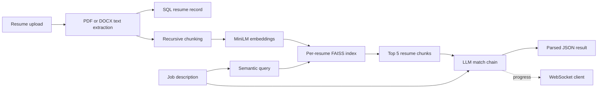
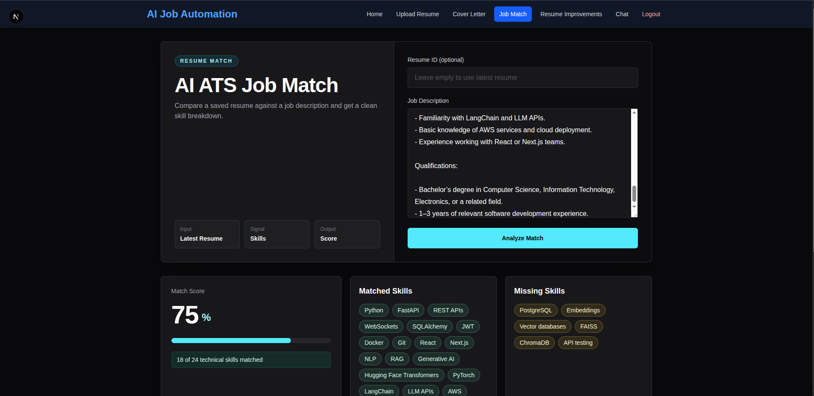
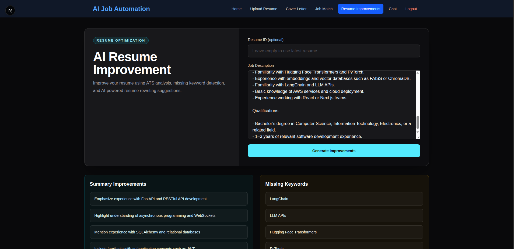
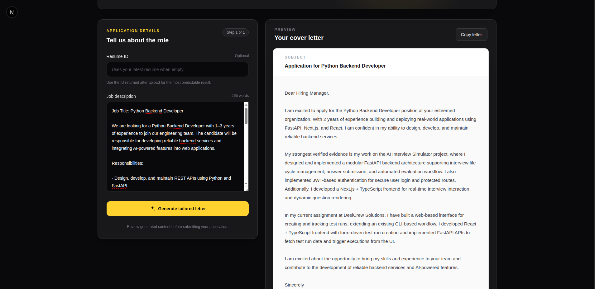
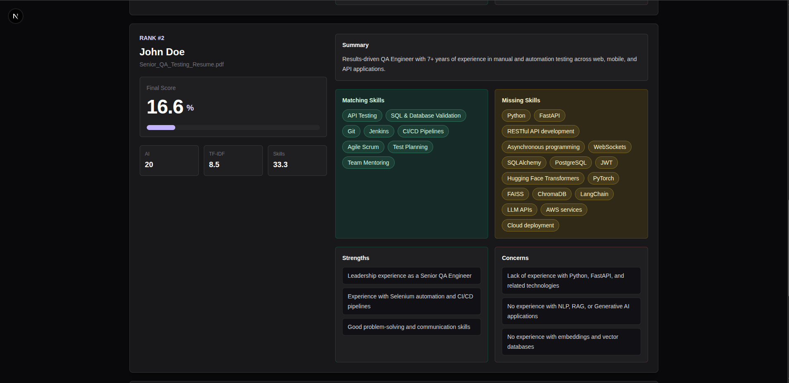

# Resume–JD RAG Matching Platform

> Analyze resume relevance against job descriptions with hybrid retrieval and LLM-assisted analysis, combining FAISS-based semantic search in the RAG workflow with lexical scoring in candidate ranking.

## Overview

Manually comparing a resume with a job description is repetitive and can make it difficult to identify evidence for every requirement. This project provides a full-stack workflow that extracts resume text, divides it into overlapping chunks, embeds those chunks, and stores them in a per-resume FAISS index. A job description is then used as a semantic retrieval query so the language model receives the most relevant resume passages rather than an arbitrary full document.

The retrieved evidence supports structured match analysis, missing-skill identification, resume-improvement suggestions, cover-letter generation, and resume-grounded chat. A separate HR workflow ranks multiple PDF resumes using TF-IDF cosine similarity and an LLM evaluation. The application demonstrates Python API development, document processing, SQL persistence, authentication, information retrieval, and practical LLM orchestration.

The generated scores and recommendations are assistive signals. They are not objective measures of candidate quality and should not replace human review or hiring decisions.

## Key features

| Area | Verified behavior |
| --- | --- |
| Resume ingestion | Accepts `.pdf` and `.docx`, extracts text, rejects unsupported extensions and empty extracted content, and stores the raw text and source metadata. |
| Chunking and embeddings | Uses `RecursiveCharacterTextSplitter` and Hugging Face MiniLM embeddings. |
| Vector search | Saves each resume under `backend/vectorstore/faiss/{resume_id}/` and retrieves the five most relevant chunks. |
| Resume–JD matching | Compares atomic JD skills against retrieved evidence and the complete stored resume, calculates TF-IDF similarity, and returns a transparent hybrid score with matched/missing skills. |
| Resume improvement | Returns structured summary, keyword, project, skill, and ATS suggestions grounded in retrieved resume context. |
| Cover letters | Generates a structured subject, letter, strengths, included keywords, and ATS-alignment notes without intentionally inventing experience. |
| Candidate ranking | Extracts multiple PDFs, calculates TF-IDF cosine similarity, requests an LLM evaluation, computes a weighted score, and sorts descending. |
| Authentication | Registers and logs in users, hashes passwords with bcrypt, issues 60-minute HS256 JWTs, and enforces the `HR` role on ranking. |
| Real-time communication | Sends status and streaming chat-token messages over a WebSocket keyed by resume ID. |
| Persistence | Uses SQLAlchemy with SQLite locally or PostgreSQL through Compose; creates tables at startup. Resume and user writes are active, while the legacy job-match write path currently has an input-key defect. |

## Complete working flow

The main RAG matching flow is:

1. A user may register or log in through the frontend. Authentication is available but is not currently required for resume upload or matching.
2. The client uploads one PDF or DOCX to `POST /resume/upload`.
3. The backend checks the filename extension and extracts text. There is no file-size limit or MIME/content signature validation.
4. The extractor creates one LangChain `Document` with `pdf` or `docx` source metadata.
5. The raw extracted text and source metadata are inserted into the `resumes` table, producing a resume ID.
6. `RecursiveCharacterTextSplitter` divides the document into 500-character chunks with 50-character overlap and adds a `chunk_id` to each chunk.
7. `all-MiniLM-L6-v2` converts the chunks into embeddings.
8. FAISS writes the index and metadata to `vectorstore/faiss/{resume_id}/`, relative to the backend working directory.
9. The user submits a job description and an optional resume ID to `POST /match/`. If the ID is omitted, the most recently stored resume is selected globally.
10. The job description becomes the vector-search query; FAISS retrieves the five most relevant resume chunks.
11. The retrieved context and job description are passed to the job-match LangChain prompt.
12. `JsonOutputParser` parses atomic matched/missing skill lists, reasoning, and recommendations. The backend calculates explicit skill coverage and full-document TF-IDF similarity, then returns `match_score = (skill coverage × 0.70) + (TF-IDF similarity × 0.30)`.
13. If a WebSocket is connected at `/ws/{resume_id}`, it receives validation, retrieval, LLM, and completion events.

Candidate ranking is a separate workflow: an authenticated HR user submits a job description and multiple PDF resumes. Each full extracted resume receives a TF-IDF score and an LLM evaluation; results are combined and sorted as described in [Candidate-ranking approach](#candidate-ranking-approach). It does not use the per-resume FAISS indexes.



## Why RAG is used

Sending an entire long resume to a model for every task uses more context and can dilute the evidence relevant to a specific job. This application instead splits the resume into overlapping chunks so neighboring details are less likely to be lost at a boundary.

The embedding model maps each chunk into a numerical vector that represents semantic meaning. FAISS compares the job-description query vector with the stored chunk vectors and returns the closest passages. Only those passages are added to the analysis prompt, helping ground the model in resume content relevant to the requested role.

This differs from keyword-only matching: vector retrieval can surface conceptually related language even when wording is not identical. The project also retains a lexical approach where it is useful—candidate ranking uses TF-IDF and cosine similarity alongside an LLM assessment.

RAG reduces irrelevant context; it does not guarantee factual, unbiased, or correct model output.

## Candidate-ranking approach

The HR ranking service uses the following verified pipeline:

1. Extract text from each uploaded PDF with `pypdf`.
2. Normalize and lemmatize the job description and resume with spaCy, removing stop words, punctuation, and whitespace.
3. Build unigram and bigram TF-IDF features and calculate cosine similarity, scaled to `0–100`.
4. Send the job description, full resume text, and TF-IDF score to an LLM prompt. Its JSON response includes an `ai_score`, skills, strengths, concerns, and a summary.
5. Calculate an informational skill-match percentage as `matching / (matching + missing) × 100`.
6. Calculate `final_score = (ai_score × 0.70) + (tfidf_score × 0.30)`.
7. Sort candidates by `final_score` in descending order and assign ranks starting at 1.

The `skill_match_score` is returned for display but is not part of the final-score formula. Candidate ranking currently has no FAISS or embedding-based scoring component, and its LLM score is model-generated rather than independently calibrated.

## Technology stack

| Technology | Purpose |
| --- | --- |
| Python 3.11 | Backend runtime declared by `.python-version` and the Docker image |
| FastAPI and Uvicorn | REST/WebSocket API and ASGI server |
| Pydantic | Request validation and selected response models |
| LangChain and LangGraph | Prompts, chains, parsers, message history, tools, and copilot agent |
| Hugging Face / Sentence Transformers | `all-MiniLM-L6-v2` document embeddings |
| FAISS | Local vector indexing and semantic retrieval |
| spaCy | Text normalization and lemmatization for lexical scoring |
| scikit-learn | TF-IDF vectorization and cosine similarity |
| SQLAlchemy | ORM, sessions, and schema creation |
| SQLite / PostgreSQL 16 | Local and containerized relational database options |
| python-jose and Passlib/bcrypt | JWT handling and password hashing |
| Ollama / Groq | Configurable LLM providers |
| WebSockets and `asyncio` | Progress messages, streamed chat tokens, and thread offloading |
| Next.js 16, React 19, TypeScript | Browser interface |
| Tailwind CSS 4 | Frontend styling |
| Docker and Docker Compose | Container definitions for frontend, backend, and PostgreSQL |

## System architecture

- **Frontend layer — `front-end/app/`:** Next.js pages collect files, job descriptions, credentials, and render results. `front-end/app/lib/api.ts` centralizes HTTP calls and stores auth tokens in browser local storage.
- **Authentication layer — `backend/core/security.py`:** hashes and verifies passwords, creates and decodes JWTs, loads users, and exposes role dependencies.
- **API layer — `backend/routes/`:** FastAPI controllers validate inputs, obtain database sessions, and call service functions.
- **Resume-processing layer — `backend/services/resume.py`, `backend/utils/file_parser.py`:** extracts PDF/DOCX text, persists resume records, and starts indexing.
- **Retrieval layer — `backend/utils/RAG_splitter.py`, `backend/core/embeddings.py`, `backend/services/FAISS.py`:** chunks documents, creates embeddings, saves indexes, and retrieves context.
- **LLM layer — `backend/chains/`:** contains prompts and JSON parsers for parsing, matching, improvements, ranking, cover letters, chat, and copilot behavior.
- **Candidate-ranking layer — `backend/services/candidate_ranking_service.py`:** coordinates PDF parsing, TF-IDF scoring, LLM evaluation, weighting, and sorting.
- **Persistence layer — `backend/db/`, `backend/models/`, `backend/repository/`:** manages users and raw resumes and defines the currently broken legacy job-match write path with SQLAlchemy.
- **Real-time layer — `backend/core/ws_manager.py`:** maintains one in-memory socket per resume ID and sends workflow events.

## Project structure

```text
.
├── backend/
│   ├── chains/              # LangChain prompts, parsers, chat memory, and agent
│   ├── core/                # Configuration, embeddings, LLM selection, CORS, security, WebSockets
│   ├── db/                  # SQLAlchemy engine, sessions, and declarative base
│   ├── models/              # User, resume, and job-match tables
│   ├── preprocessing/       # spaCy preprocessing for TF-IDF
│   ├── repository/          # Resume and job-match database operations
│   ├── routes/              # FastAPI HTTP and WebSocket endpoints
│   ├── schemas/             # Pydantic request and response types
│   ├── services/            # RAG, matching, ranking, chat, and generation logic
│   ├── tests/               # Minimal API test suite
│   ├── tools/               # LangChain tools exposed to the career copilot
│   ├── utils/               # File extraction, PDF ranking reader, and text splitting
│   ├── .env.example         # Safe local database example (incomplete for AI features)
│   ├── Dockerfile           # Python backend image
│   ├── main.py              # FastAPI application entry point
│   └── requirements.txt     # Backend dependencies
├── front-end/
│   ├── app/                 # Next.js routes, components, styling, and API client
│   ├── public/              # Static frontend assets
│   ├── Dockerfile           # Multi-stage Next.js image
│   ├── package.json         # npm scripts and dependencies
│   └── tsconfig.json        # TypeScript configuration
├── .github/workflows/       # Backend push CI workflow
└── docker-compose.yml       # Backend, frontend, and PostgreSQL topology
```

Generated databases, private resumes, `.env` files, caches, frontend build output, and `backend/vectorstore/` indexes are intentionally omitted from this tree.

## Installation and local setup

### Prerequisites

- Python 3.11
- Node.js 20 or later and npm
- Either a local [Ollama](https://ollama.com/) model or Groq API credentials

PostgreSQL is optional for manual local development; SQLite works through `DATABASE_URL`. There is no migration framework. SQLAlchemy calls `Base.metadata.create_all()` when the application starts.

### 1. Clone the repository

```bash
git clone https://github.com/whitedevil1233rrffrfrrferf/Job-simulator.git
cd Job-simulator
```

### 2. Set up the backend

```bash
cd backend
python3.11 -m venv .venv
source .venv/bin/activate
python -m pip install --upgrade pip
pip install -r requirements.txt
cp .env.example .env
```

Complete `backend/.env` using the safe template in [Environment variables](#environment-variables), then start the API from `backend/`:

```bash
uvicorn main:app --host 127.0.0.1 --port 8000 --reload
```

Open:

- API root: <http://127.0.0.1:8000/>
- Swagger UI: <http://127.0.0.1:8000/docs>
- OpenAPI JSON: <http://127.0.0.1:8000/openapi.json>

The first embedding request downloads `all-MiniLM-L6-v2`. Ollama users must separately install/run Ollama and make the configured model available.

### 3. Set up the frontend

In a second terminal:

```bash
cd front-end
npm ci
```

Create `front-end/.env.local`:

```dotenv
NEXT_PUBLIC_API_BASE_URL=http://127.0.0.1:8000
```

Then run:

```bash
npm run dev
```

Open <http://localhost:3000>.

### Database options

The default example uses SQLite:

```dotenv
DATABASE_URL=sqlite:///./app.db
```

For PostgreSQL, create the database/user yourself and supply a SQLAlchemy psycopg URL. Do not commit the credentials. No Alembic migrations are present; tables are created at application startup.

### Docker status

`docker compose config --quiet` succeeds, and the repository contains images for all three services. The current Compose file is still development-oriented: it includes database credentials directly and does not inject `NEXT_PUBLIC_API_BASE_URL` during the frontend build. Resolve those configuration issues before treating `docker compose up --build` as a supported full-stack setup.

## Environment variables

The checked-in `backend/.env.example` contains only `DATABASE_URL`; the remaining names below are read by source code and are needed only for the relevant provider or feature.

| Variable | Purpose | Required? | Safe example |
| --- | --- | --- | --- |
| `DATABASE_URL` | SQLAlchemy connection URL | Yes | `sqlite:///./app.db` |
| `LLM_PROVIDER` | Selects `ollama` or `groq` | Yes for LLM features | `ollama` |
| `OLLAMA_MODEL` | Local model name | When provider is Ollama | `your-local-model` |
| `GROQ_API_KEY` | Groq credential | When provider is Groq | `replace-with-your-key` |
| `GROQ_MODEL` | Groq model identifier | When provider is Groq | `replace-with-supported-model` |
| `NEXT_PUBLIC_API_BASE_URL` | Browser-visible FastAPI base URL | Yes for frontend API calls | `http://127.0.0.1:8000` |

Example `backend/.env` for local Ollama use:

```dotenv
DATABASE_URL=sqlite:///./app.db
LLM_PROVIDER=ollama
OLLAMA_MODEL=your-local-model
```

The JWT signing secret is currently hard-coded in `backend/core/security.py`; there is no environment variable for it yet. This must be corrected before deployment.

## API documentation

Unless noted otherwise, the current routes do **not** require authentication.

### Authentication

| Method | Endpoint | Purpose | Input | Auth |
| --- | --- | --- | --- | --- |
| `POST` | `/auth/register` | Create a user and issue a JWT | JSON: `name`, `email`, `password`, `role` (`USER` or `HR`) | No |
| `POST` | `/auth/login` | Verify credentials and issue a JWT | JSON: `email`, `password` | No |

### Resume processing and RAG workflows

| Method | Endpoint | Purpose | Input | Auth |
| --- | --- | --- | --- | --- |
| `POST` | `/resume/upload` | Extract, store, chunk, embed, and index a PDF/DOCX | Multipart field `file` | No |
| `POST` | `/resume/parse` | LLM-parse supplied raw text and store it; does not build FAISS | JSON: `resume_text` | No |
| `POST` | `/match/` | Retrieve resume context and analyze JD match | JSON: optional `resume_id`, `job_description` | No |
| `POST` | `/resume-improvement/generate` | Generate grounded improvement suggestions | JSON: optional `resume_id`, `job_description` | No |
| `POST` | `/cover-letter/generate` | Generate a grounded structured cover letter | JSON: optional `resume_id`, `job_description` | No |
| `POST` | `/chat/ask` | Ask a question using retrieved resume context | JSON: optional `resume_id`, `question` | No |
| `WS` | `/ws/{resume_id}` | Receive workflow progress and chat-token events | Path parameter and WebSocket connection | No |

### Ranking and other APIs

| Method | Endpoint | Purpose | Input | Auth |
| --- | --- | --- | --- | --- |
| `POST` | `/hr/candidates/rank` | Rank multiple candidate PDFs against one JD | Multipart `job_description` and repeated `resumes` | Bearer JWT; `HR` role |
| `POST` | `/analyze-job/` | Experimental raw-text parse/match route; currently broken by a chain input-key mismatch and does not reach persistence | JSON: `resume_text`, `job_description` | No |
| `POST` | `/copilot/` | Route a career request to available LangChain tools | JSON: `prompt`, optional `resume_id`, `job_description`, `location` | No |
| `GET` | `/` | Basic API status message | None | No |

### Example requests

These examples show the current request shapes. IDs and generated responses are illustrative, not measured results.

Register an HR account:

```bash
curl -X POST http://127.0.0.1:8000/auth/register \
  -H 'Content-Type: application/json' \
  -d '{"name":"Example User","email":"user@example.com","password":"replace-me","role":"HR"}'
```

Example response:

```json
{
  "access_token": "<token>",
  "token_type": "bearer",
  "role": "HR"
}
```

Upload and index a resume:

```bash
curl -X POST http://127.0.0.1:8000/resume/upload \
  -F 'file=@sample-resume.pdf;type=application/pdf'
```

Example shortened response:

```json
{
  "id": 42,
  "raw_text": "<extracted resume text>",
  "structured_data": "{\"source\": \"sample-resume.pdf\"}"
}
```

Match the stored resume against a job description:

```bash
curl -X POST http://127.0.0.1:8000/match/ \
  -H 'Content-Type: application/json' \
  -d '{"resume_id":42,"job_description":"Seeking a Python API developer with FastAPI and SQL experience."}'
```

Example response shape:

```json
{
  "match_score": 0,
  "matched_skills": ["<skill found in resume>"],
  "missing_skills": ["<required skill not found>"],
  "reasoning": "<model-generated explanation>",
  "recommendations": ["<grounded suggestion>"]
}
```

Request resume improvements:

```bash
curl -X POST http://127.0.0.1:8000/resume-improvement/generate \
  -H 'Content-Type: application/json' \
  -d '{"resume_id":42,"job_description":"<job description>"}'
```

Generate a cover letter:

```bash
curl -X POST http://127.0.0.1:8000/cover-letter/generate \
  -H 'Content-Type: application/json' \
  -d '{"resume_id":42,"job_description":"<job description>"}'
```

Rank candidate PDFs with the token returned by HR login/registration:

```bash
curl -X POST http://127.0.0.1:8000/hr/candidates/rank \
  -H 'Authorization: Bearer <token>' \
  -F 'job_description=<job description>' \
  -F 'resumes=@candidate-a.pdf;type=application/pdf' \
  -F 'resumes=@candidate-b.pdf;type=application/pdf'
```

Example shortened ranking response:

```json
[
  {
    "rank": 1,
    "candidate_name": "<name extracted by model>",
    "resume_filename": "candidate-a.pdf",
    "final_score": 0.0,
    "ai_score": 0,
    "tfidf_score": 0.0,
    "skill_match_score": 0.0,
    "matching_skills": [],
    "missing_skills": [],
    "strengths": [],
    "concerns": [],
    "summary": "<model-generated summary>"
  }
]
```

## Data handling and privacy

- Uploaded resume text is stored in the configured SQL database. The primary upload flow does not save the original uploaded PDF/DOCX file.
- FAISS writes `index.faiss` and `index.pkl` beneath `backend/vectorstore/faiss/{resume_id}/` when the backend runs from `backend/`.
- There is no automatic retention policy or deletion endpoint for resume records or vector indexes.
- Generated match, improvement, cover-letter, chat, and ranking results are not persisted. A `JobMatch` model/repository exists, but the legacy `/analyze-job/` route currently fails before reaching that write.
- If no resume ID is supplied, several services select the latest resume globally. There is no ownership check between a user and a resume.
- The application logs extracted chunks, retrieved resume context, some generated results, and request debugging information. These logs can contain personal data.
- FAISS loading enables `allow_dangerous_deserialization=True`; only trusted local index files should be loaded.
- Data is not encrypted by application code, WebSockets are unauthenticated, CORS permits every origin, and frontend JWTs are stored in local storage.
- The repository currently contains generated FAISS index artifacts. They should be removed from version control if they contain real or derived resume data.

> **Privacy warning:** resumes may contain personal and sensitive information. Never commit real resumes, generated FAISS indexes, `.env` files, access tokens, API keys, database credentials, or personal-data logs to Git. Treat the current application as a development/portfolio project unless production security controls have been implemented and independently verified.

## Security considerations

Verified protections include PDF/DOCX extension checks in the primary upload flow, empty-text rejection, Pydantic request validation, bcrypt password hashing, expiring JWTs, and HR-role enforcement on candidate ranking.

Important gaps include a hard-coded JWT secret, open registration that allows clients to request the HR role, no password policy, no upload-size limits or content-signature validation, wildcard CORS, missing ownership checks, unauthenticated WebSockets and most API routes, and no application-level encryption or cleanup policy. Candidate ranking also lacks explicit file validation and attempts to parse every submitted file as a PDF.

## Demo

The repository includes walkthrough recordings for both application roles:

- [Watch the job-seeker workflow](docs/demos/User_flow.webm)
- [Watch the HR candidate-ranking workflow](docs/demos/hr_flow.webm)

> GitHub opens the WebM files in its media viewer. A public live-application URL has not been added.

### Resume–JD match analysis

The match view compares a saved resume with a pasted job description and presents the overall score with matched and missing technical skills.



### Resume improvement suggestions

The improvement workspace organizes generated feedback into summary improvements, missing keywords, project suggestions, skill recommendations, and ATS-focused tips.



### Grounded cover-letter generation

The cover-letter workspace pairs job details with a paper-style preview and supports copying the generated application text.



### HR candidate ranking

The HR view displays ranked candidates with final, AI, TF-IDF, and skill scores alongside matched skills, missing skills, strengths, concerns, and an LLM-generated summary.



## Current limitations

- Most endpoints do not enforce authentication, and resume records have no user ownership relationship.
- Users can self-select the HR role during public registration.
- Omitting `resume_id` selects the latest resume across the entire database.
- FAISS indexes are local, trusted-pickle-based files with no automatic cleanup or distributed storage.
- Match, improvement, cover-letter, chat, and candidate-ranking results are not stored as user history.
- Candidate ranking processes PDFs sequentially and does not validate extension, MIME type, size, or empty content before parsing.
- Candidate ranking depends on an LLM-generated score and has no evaluation dataset or calibration evidence.
- Chat history and WebSocket connections are in-memory, single-process state and disappear on restart.
- WebSocket URLs are hard-coded in active frontend pages, and some socket integrations are commented out.
- CORS is unrestricted, the JWT secret is hard-coded, and tokens are stored in browser local storage.
- Raw resume chunks and selected generated content are printed to backend logs.
- Database tables are created directly at startup; there are no schema migrations.
- External LLM and embedding integrations require local model availability, model downloads, network access, or third-party credentials.
- Automated coverage is limited to one root-endpoint test; `pytest` is not in backend requirements and no frontend test suite exists.
- The Docker setup needs build-time frontend configuration and secret handling improvements.
- The legacy raw-text analysis route has a prompt-variable mismatch.
- No production deployment, monitoring, or model-quality evaluation is included.

## Learning outcomes

This repository demonstrates:

- Designing FastAPI REST and WebSocket APIs
- Extracting PDF and DOCX content and representing it as LangChain documents
- Implementing overlapping document chunking and sentence-transformer embeddings
- Creating, saving, loading, and querying per-document FAISS indexes
- Building retrieval-augmented prompts and parsing LLM responses into JSON
- Combining TF-IDF, cosine similarity, and LLM analysis in a separate ranking pipeline
- Modeling relational data and repository operations with SQLAlchemy
- Implementing password hashing, JWT authentication, and a role-protected workflow
- Offloading blocking AI/retrieval work from async endpoints and streaming chat events
- Integrating a Python AI backend with a typed Next.js frontend
